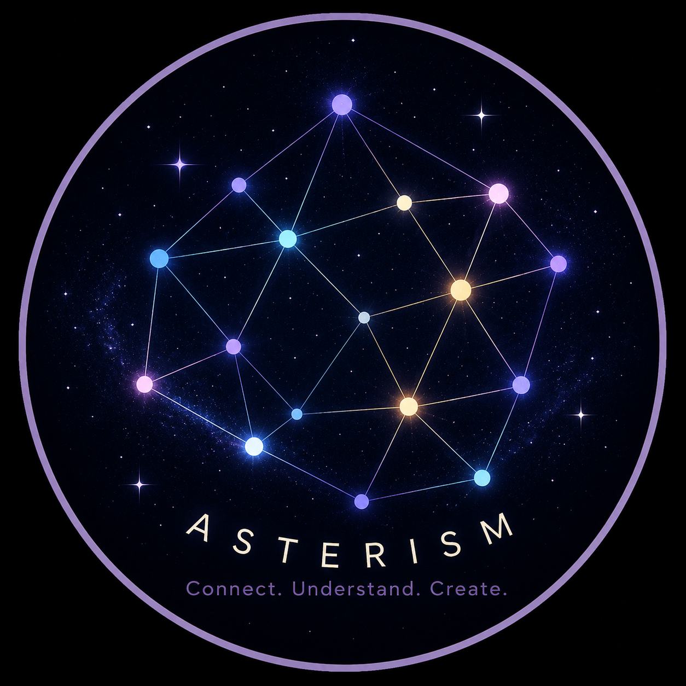

<div align="center">



# Asterism

### Every note is a star. Understanding begins when we connect them.

**An asterism is a pattern people draw between stars — the stars themselves aren't
connected, we make the connection. Every note, article, and conversation you capture
is a star on its own. Asterism's job is the connections you and your agent draw
between them.**

[Vision](#vision) · [What ships today](#what-ships-today) · [Get started](#get-started) · [Architecture](#architecture) · [Why local-first](#your-data-stays-yours)

</div>

---

## Vision

Asterism is a local-first personal knowledge base with an agent inside — but the destination isn't another note-taking app or a search box over your PDFs. It's a **personal knowledge OS built around a knowledge graph**:

> Knowledge is not valuable because it is stored. It becomes valuable because meaningful relationships are discovered.

```text
              Capture (URL or text)
                        │
                        ▼
                Fetch + extract
                        │
                        ▼
   Triage · Digest · Critique · Claims ──── Streaming chat over the source
                        │
                        ▼
             Source-to-source connections
                        │
                        ▼
                Highlights you save
                        │
                        ▼
   Concept extraction → embedding → dedup
                        │
                        ▼
             Knowledge graph (SQLite)
                        │
                        ▼
        Wiki (browsable markdown pages)
```

Everything in [What ships today](#what-ships-today) is what actually exists right now, built on the current backend/frontend stack. Ahead: copilot retrieval across the whole library and a Dashboard/Feed.

## What ships today

### Capture, triage, and cross-check

- **Capture** — paste a URL or raw text and Asterism fetches, extracts, and stores it (`trafilatura`, with an AI fallback for thin extractions).
- **Triage Card** — every source gets a read-time estimate, a density/novelty read, and a deep-read/skim/skip recommendation before you commit to reading it.
- **Digest, Critique, Claims** — a LangGraph fan-out/fan-in pipeline pulls a summary, hidden assumptions, and atomic, source-quote-anchored claims out of the content, each field independently retryable.
- **Source-to-source connections** — claims are checked against your existing library for what they support, repeat, or contradict.

Every verdict is advisory and every analysis field is editable — the reader stays human.

### Chat over what you've read

Per-source streaming chat (SSE), with multiple named conversations per source and text-selection auto-attach as context, so you can ask a source a question instead of re-reading it.

### The knowledge graph

- **Highlights become graph nodes** — anything you highlight is run through concept extraction → embedding → nearest-neighbor dedup. High-confidence merges auto-apply; ambiguous ones (and anything flagged `contradicts`) queue for your review.
- **Every analyzed source is a node too** — an automatic, cheaper Tier-1 pass feeds each source's digest concepts through the same pipeline, no highlight required.
- **Per-point feedback** — thumbs up/down individual Digest concepts, Claims, or Critique points; a thumbs-up can be promoted straight into the graph.
- **Wiki compile** — renders the graph into browsable markdown: one synthesized page per qualifying concept, a regenerated index, and an append-only change log. The graph stays the source of truth; wiki pages are a regenerable projection of it.

### Radar — proactive content discovery

A daily-refreshable feed of RSS-sourced recommendations, ranked by relevance (concept-graph embedding similarity + LLM judgment against your saved boost topics) and quality (judged from full article text, not a hardcoded per-source trust score) — kept as two separate scores, never averaged. One click adds an item straight into your library; dismiss drops it. Feed sources and boost topics are fully user-editable (add/delete), seeded with a couple of defaults on first run.

Refresh manually from the `/radar` page, or schedule it via launchd (macOS):

```bash
cp backend/scripts/com.asterism.radar-refresh.plist.template ~/Library/LaunchAgents/com.asterism.radar-refresh.plist
# Edit the copy: replace __PYTHON_BIN__ (e.g. `which python3` inside your uv venv),
# __REPO_ROOT__, __ASTERISM_DATA_ROOT__, and __HOME__ with your actual paths.
launchctl load ~/Library/LaunchAgents/com.asterism.radar-refresh.plist
```

Runs once daily (default 08:00, edit `StartCalendarInterval` in the plist to change it). Unlike cron, launchd fires a missed run on next wake if the machine was asleep at the scheduled time. Output/errors land in `~/Library/Logs/asterism-radar-refresh.log`. The same template pattern can be copied for `backend/scripts/wiki_compile.py`.

### Browser extension

Captures the current tab's rendered page into your library — useful for content behind a login wall (e.g. a paid Medium article) that server-side fetching can't reach. Load it as an unpacked extension from the `browser-extension/` directory.

## Get started

You need **Python 3.11+** with [uv](https://docs.astral.sh/uv/), **Node 20+**, and one agent CLI you already use, signed in: [Claude Code](https://docs.claude.com/en/docs/claude-code/setup) (`claude`) or [OpenAI Codex](https://github.com/openai/codex) (`codex`) — or an Anthropic/OpenAI API key instead.

```bash
git clone https://github.com/AkiraWinds/Asterism.git
cd Asterism
```

**Backend** (FastAPI, port 8000):

```bash
cd backend
uv sync
uv run uvicorn app.main:app --reload --port 8000
```

Data is stored under `$ASTERISM_DATA_ROOT` (defaults to `~/AsterismData`). Create `config.json` there to pick your agent:

```json
{ "strategy": "cli", "provider": "claude" }
```

or, for a direct API key instead of a CLI session:

```json
{ "strategy": "api-key", "provider": "anthropic", "api_key": "sk-ant-..." }
```

The knowledge graph's embedding step always calls OpenAI directly (Anthropic has no embeddings endpoint, and CLI providers can't embed at all) — set `"embeddings_api_key"` in the same `config.json` for that feature to work.

**Frontend** (Next.js, port 3000):

```bash
cd frontend
npm install
npm run dev
```

Open [http://localhost:3000](http://localhost:3000).

**Browser extension (optional)**

Captures the current tab's rendered page into your library — useful for content behind a login wall (e.g. a paid Medium article) that server-side fetching can't reach.

1. Start the backend (`http://localhost:8000` by default).
2. In Chrome, go to `chrome://extensions`, enable Developer Mode.
3. Click "Load unpacked" and select the `browser-extension/` directory.
4. Click the extension icon on any page and hit "Save this page". If your backend runs somewhere other than `http://localhost:8000`, set it in the extension's Options page first.

## Architecture

- **`backend/`** — Python/FastAPI owns everything: local-first file storage, AI provider abstraction (CLI-subprocess or API key), content ingestion/analysis, the knowledge graph, and chat. Analysis pipelines are built as LangGraph graphs so individual fields checkpoint and retry independently.
- **`frontend/`** — Next.js is a thin client over the backend's REST/SSE API. No business logic lives here.
- **`docs/`** — mainly `docs/assets/` for this README. Onboarding notes, architecture specs, phase plans, and session summaries are local-only working notes, not tracked in git.

## Your data stays yours

- **You choose where it lives** — `$ASTERISM_DATA_ROOT`, any folder you control.
- **Captures are preserved as evidence** — `meta.json` and the original fetched content are written once and never modified; analysis, chat, and derived files are editable and regenerable.
- **No Asterism cloud** — analysis runs through your own authenticated agent session or your own API key, never a hosted backend.

Inspect your data folder, back it up, sync it, or delete it with normal file tools.
