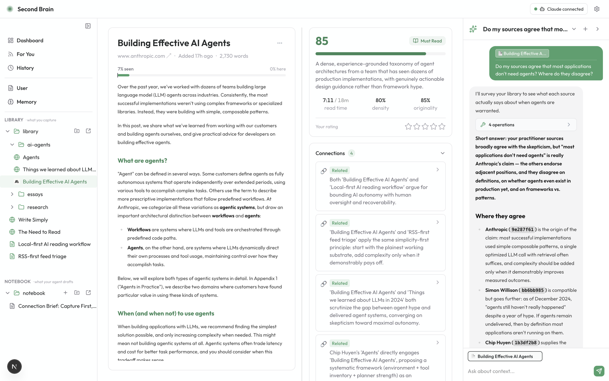

<div align="center">


# Asterism

### Every note is a star. Understanding begins when we connect them.

[](LICENSE)
[](#get-started-in-2-minutes)
[](#your-data-stays-yours)
[](CONTRIBUTING.md)

**An asterism is a pattern people draw between stars — the stars themselves aren't
connected, we make the connection. Every note, article, and conversation you capture
is a star on its own. Asterism's job is the connections you and your agent draw
between them.**

[Vision](#vision) · [What ships today](#what-ships-today) · [Get started](#get-started-in-2-minutes) · [Why local-first](#your-data-stays-yours)


**[▶ Watch the full video](https://x.com/ranli_thinker/status/2073458125391425759)**

</div>

---

## Vision

Asterism is a local-first personal knowledge base with an agent inside — but the destination isn't another note-taking app or a search box over your PDFs. It's a **personal knowledge OS built around a knowledge graph**:

> Knowledge is not valuable because it is stored. It becomes valuable because meaningful relationships are discovered.

```text
Markdown · Notion · PDFs · GitHub repos · Web articles · Meeting notes · Chat history
                              │
                              ▼
                        Knowledge Graph
                              │
        Semantic search · Entity linking · Relationship discovery · AI copilot
```

Today's app is the first layer: capture, triage, and cross-checking. The graph, multi-source ingestion, and graph-aware retrieval are the direction. Everything in [What ships today](#what-ships-today) is what actually exists right now.

## What ships today

### Capture, triage, and cross-check

Nobody needs one more tool that turns essays into three bullets so you can pretend you read them. Asterism's AI does two jobs, and reading for you isn't one of them:

- **Capture in seconds** — paste a link or text, drop a PDF or image, or one-click the Chrome extension (logged-in and JS-rendered pages included).
- **Filter before you read** — every capture is scored and critiqued, so AI slop and shallow takes get flagged before they cost you twenty minutes.
- **Let the library argue with itself** — new captures are checked against your existing sources: what they support, repeat, or **contradict**.

Every verdict is advisory, every analysis editable — the reader stays human.

<div align="center">

<br/>
<em>The original stays front and center. The verdict, the critique, and a "this contradicts what you read last week" sit beside it.</em>
</div>

### Agentic, and it learns from you

- **Your library is the agent's workspace** — plain local files the agent reads and organizes directly. Ask it to reorganize the library or draft a post from what you've been reading lately, straight into your Notebook.
- **It learns from your behavior** — clicks, ratings, starred highlights, and Knew/Learned tracking become local feedback signals that sharpen the agent over time.
- **A feed that knows your library** — "For You" ranks RSS (and optional web search) against your interests and reading history, no API key required.
- **Memory you can read** — `USER.md` holds your explicit preferences; `MEMORY.md` is the agent's own evolving, editable notes about you.

<div align="center">

<br/>
<em>Ask across your library — the agent works the same files you see, and shows its work.</em>
</div>

## Get started in 2 minutes

All you need is **Node 20+** and one agent CLI you already use, signed in:
[Claude Code](https://docs.claude.com/en/docs/claude-code/setup) (`claude`) or [OpenAI Codex](https://github.com/openai/codex) (`codex`).
Core analysis runs through that local CLI: no separate model API key, no metered bill from Asterism.

```bash
git clone https://github.com/AkiraWinds/Asterism.git
cd Asterism
npm install
npm run dev
```

Open [http://localhost:3000](http://localhost:3000), confirm your agent shows **Connected**, and hit **Enable Agent Mode**. First launch seeds a small example library so you can feel the product before capturing anything.

Want a guided path? See [docs/ONBOARDING.md](docs/ONBOARDING.md).

The optional **Chrome extension** captures pages exactly as you see them — including logged-in pages, JS-heavy apps, and tweets. Load it from `chrome://extensions` → **Load unpacked** → select the `extension/` folder. No extension? Paste links, text, PDFs, and images straight into the dashboard.

## Your data stays yours

- **You choose where it lives** — the default local folder, or point `SECONDBRAIN_ROOT` at any folder you control.
- **Captures are preserved as evidence** — originals stay untouched; AI analysis is editable and regenerable.
- **No Asterism cloud** — everything is analyzed through your authenticated local agent session, never a hosted backend.

Your user data folder is just files: a `Library/` of what you captured and a `Notebook/` of what you or the agent wrote from it. Inspect it, back it up, sync it, or delete it with normal file tools.

## Under the hood

<details>
<summary><b>Feed generation</b></summary>

The For You feed has two inputs:

- RSS feeds, enabled by default and editable in **Settings → Feed**.
- Optional web search, enabled only when you add a [Brave Search API key](https://brave.com/search/api/).

Radar topics from Settings tune both feed ranking and web-search queries, so the briefing stays connected to what you already care about.

```bash
cp .env.example .env.local   # then paste your key into BRAVE_SEARCH_API_KEY
```

`.env.local` is git-ignored. Without a key, the feed still runs on RSS and says so clearly.

</details>

<details>
<summary><b>Agent runtime</b></summary>

Asterism calls a local agent CLI via subprocess — Claude Code (`claude`) or OpenAI Codex (`codex`). Pick your provider in Agent Mode setup or Settings.

- Core analysis runs through your authenticated local agent session, so no separate model API key is required.
- Agent Mode is required: if no provider is connected, you get a setup gate instead of a degraded app.
- Prompt/response debug logs are **off by default**. `SECONDBRAIN_AGENT_DEBUG_LOGS=1` enables them for local debugging only — they can contain source text.

Provider-specific spawn details stay in the provider layer; the rest of the app calls one shared agent interface.

</details>

<details>
<summary><b>Development</b></summary>

```bash
npm test
npm run lint
npm run build
```

Pipeline tracing: `SECONDBRAIN_DEBUG=1 npm run dev`.

Contributor guide: [CONTRIBUTING.md](CONTRIBUTING.md). Agent-facing project context lives in [AGENTS.md](AGENTS.md) (`CLAUDE.md` is a symlink so Claude Code and Codex share one context).

</details>

## License

[MIT](LICENSE) — Asterism began as a fork of [SecondBrain](https://github.com/ryannli/secondbrain); the original license and attribution are preserved.
